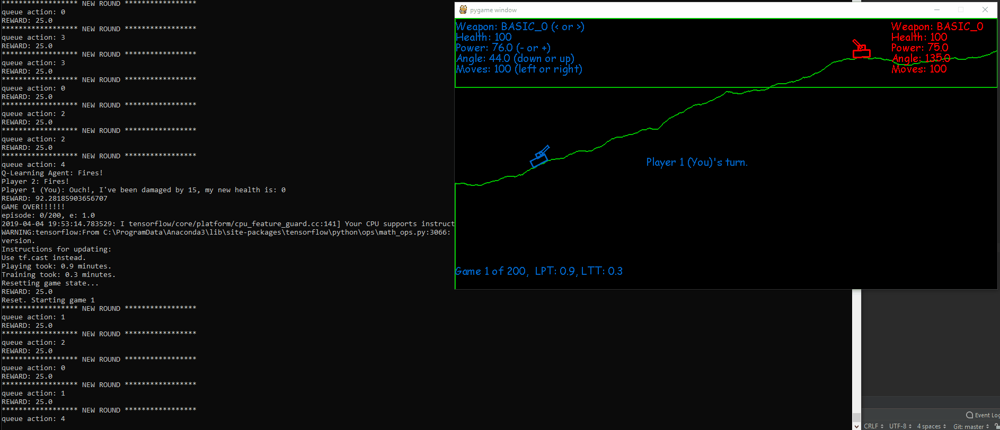

# PocketTanks
Here I recreate the classic game Pocket Tanks setup with a 'Dumb' AI that shoots randomly then walks in toward the target, and a Q-Learning based AI that will learn how to play the game!


## Training in action!



## Installation/Setup
I like to use Anaconda 3 for my projects, so download and install that. Then in an anaconda prompt pip install the following libs:
```
keras
tensorflow
matplotlib
numpy
pygame
```

Then you can clone this repo and get running

## Running
Open an anaconda prompt and `cd` to the projects root directory. Then run 
```
python main.py
``` 
to play the game  
  
OR  
  
```
python trainer.py
```
to train DeQuaN!

## Controls
The following keys have the following commands for the game:  
h: headless - turns the training session headless or not
q: quit - ends the game
, or .: Change the selected weapon
- or =: decrease or increase the power
left arrow or right arrow: decrease or increase the angle
f: fire - launch the selected projectile.
